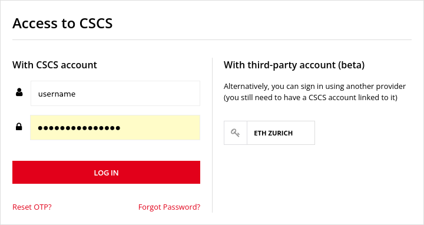

# Multi Factor Authentification

!!! todo
    This needs to be refactored somewhat to include all of the docs from the following locations

    * [main mfa page](https://confluence.cscs.ch/pages/viewpage.action?pageId=794296407)
    * [windows](https://confluence.cscs.ch/display/KB/Connecting+to+CSCS+systems+through+MFA+on+Windows)
    * [reset otp](https://confluence.cscs.ch/display/KB/Reset+OTP)

!!! note
    Below is a cut and past of part of the docs from the first link above - I stop and rethink how we want to organise these docs before continuing

To access CSCS services and systems users are required to authenticate using multi-factor authentication (MFA).
MFA is implemented as a two-factor authentication, where one factor is the login and password pair ("the thing you know") and the other factor is the device which generates one-time passwords (OTPs, "the thing you have").
In this way security is significantly improved compared to single-factor (password only) authentication.

## How MFA works at CSCS

The MFA workflow uses a time-based one-time password (OTP) to verify identity.
An OTP is a six-digit number which changes every 30 seconds.
OTPs are generated using a tool installed on a device other than the one used to access CSCS services and infrastructure.
We recommend to use a smartphone with an application such as Google Authenticator to obtain the OTPs.

## Setting up MFA at CSCS

MFA is being introduced gradually to all CSCS users: you will receive an email to inform you about the procedure.
The next time you log in to any of the CSCS web applications such as UMP, Jupyter, etc., you will be asked to register your device.

Firstly, you will be asked to provide a code that you received by email.
After this validation step, you will need to scan a QR code with your mobile phone using an application such as Google Authenticator.
Lastly, you will need to enter the OTP from the authenticator application to complete the registration of your device.
From then on, two-factor authrentication will be required to access CSCS services and systems.
A more detailed explanation of the registration process is provided in the next section.

!!! warning
    It is not possible to log in to CSCS systems using SSH without registering a device and creating certified SSH keys.
    See below for details on generating certified SSH keys

### Authenticator Application

CSCS supports authenticators that follow an open standard called [TOTP](https://en.wikipedia.org/wiki/Time-based_one-time_password).
The recommended way to access such an authenticator is to install an application on your mobile phone.
Google Authenticator and FreeOTP have been tested successfully; however, if you are using a different mobile application for OTPs, feel free to continue using it - given it supports the TOTP standard.

You can download Google Authenticator for your phone:

* :fontawesome-brands-android: Android: on the [Google Play Store](https://play.google.com/store/apps/details?id=com.google.android.apps.authenticator2).
* :fontawesome-brands-apple: iOS: on the [Apple Store](https://play.google.com/store/apps/details?id=com.google.android.apps.authenticator2).

### Configure the Authenticator

Before starting, ensure that the following pre-requisites are satisfied

1. You have an invitation email from CSCS for MFA enrollment
    * a notification email will be sent atleast one week before we sent the invitation email.
2. You have installed an OTP Authenticator app on your mobile device (see above).

!!! note
    If you try access any of our web applications without setting up MFA, you will be redirected to enroll for MFA.

!!! warning
    If you try to SSH to CSCS systems without setting up MFA, you will be prompted with permission denied error, for example:
    ```
    > ssh ela.cscs.ch
    bobsmith@ela.cscs.ch: Permission denied (publickey).
    Connection closed by UNKNOWN port 65535
    ```

Steps:

1. Access any of the CSCS Web applications such as [`account.cscs.ch`](https://account.cscs.ch), Jupyter, etc., on a new browser session which will redirects you to the CSCS login page.
2. Log in with your username and password.
3. You will be asked to key in a code which CSCS Authentication system sent to you by email.
   After successfaul validation of the code you will be redirected to the next page which present a QR code.
4. Scan the QR code with the authenticator app that was installed on your mobile device.
   After scanning the QR code the authenticator app will start generating a new 6 digit OTP every 60 seconds.
5. To complete the OTP registration process, please enter the 6 digit OTP from the authenticator app at the bottom of the the same QR code page. Optionally, you can input your device name where you imported the OTP seed by scanning the QR code
6. On successful registration you will be logged into the CSCS web application that you accessed in step-1

!!! todo
    do we need the images from KB?

## Using MFA to acccess web-based services
After having completed the setup of your authenticator, you will be asked to enter your login/password and the OTP to access all web-based services.

1. Enter username and password.
    * if the wrong username / password combination is entered, you will see an error.
    
2. Then you will be prompted to enter the 6-digit code obtained from your device.
    

!!! warning
    When replacing your smartphone remember to sync the authenticator app before resetting the old smartphone.
    Otherwise, you will have to reset the CSCS MFA, by opening a ticket

!!! todo
    finish copying docs. I think that we should probably refactor these to multiple pages

    * move the windows and resetting otp docs to this page
    * make using MFA to log in its own page.
